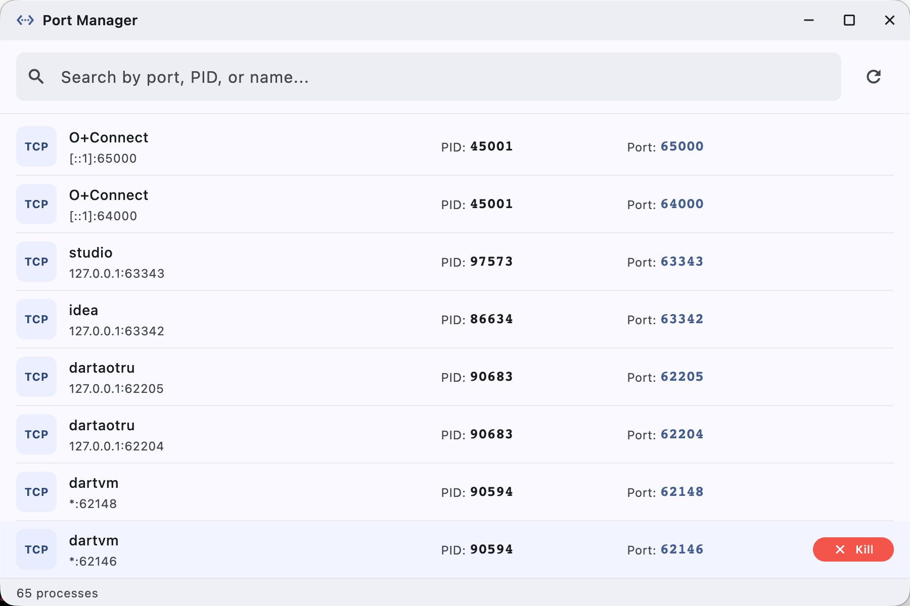

# PortProcess

A beautiful cross-platform port management tool built with Flutter. Supports macOS, Windows, and Linux.

## Features

- **Real-time Process Monitoring** - Automatically lists all local processes with bound ports
- **Smart Search** - Filter processes by port number, PID, or process name
- **One-click Kill** - Terminate processes with a single click (with confirmation)
- **Native System Integration** - UI colors blend seamlessly with your system accent color
- **Auto-refresh** - Process list refreshes automatically every 5 seconds
- **Custom Title Bar** - Clean, modern window chrome on all platforms

## Getting Started

### Prerequisites

- [Flutter](https://flutter.dev/docs/get-started/install) 3.11.5 or higher
- For macOS: Xcode (for building)
- For Windows: Visual Studio 2022 (for building)
- For Linux: GCC toolchain (for building)

### Installation
```bash
# Clone the repository
git clone https://github.com/caixinyun/portprocess.git
cd portprocess

# Install dependencies
flutter pub get

# Run the app
flutter run
```

### Download Prebuilt Binaries

Download the latest release from the [Releases](https://github.com/caixy-plus/PortProcess/releases) page.

| Platform | File |
|----------|------|
| macOS (Universal) | `.dmg` |
| Windows (x86_64) | `.msi` |
| Linux (x86_64) | `.tar.gz` |

### Building from Source

```bash
# macOS
flutter build macos

# Windows
flutter build windows

# Linux
flutter build linux
```

### Automated Release

Push a version tag to trigger the GitHub Actions release workflow:

```bash
git tag v1.0.0
git push origin v1.0.0
```

The workflow will automatically build and upload:
- `PortProcess_v1.0.0_macos_universal.dmg`
- `PortProcess_v1.0.0_windows_x86_64.msi`
- `PortProcess_v1.0.0_linux_x86_64.tar.gz`

## Architecture

```
lib/
├── main.dart                 # App entry point
├── models/
│   └── process_info.dart     # Data model for process info
├── services/
│   └── process_service.dart  # Platform-specific process fetching
└── screens/
    └── home_screen.dart      # Main UI
```

### Supported Commands per Platform

| Platform | List Ports | Kill Process |
|----------|-----------|--------------|
| macOS    | `lsof`    | `kill -9`    |
| Linux    | `ss` / `netstat` | `kill -9` |
| Windows  | `netstat` | `taskkill`   |

## License

MIT License - see [LICENSE](LICENSE) for details.
